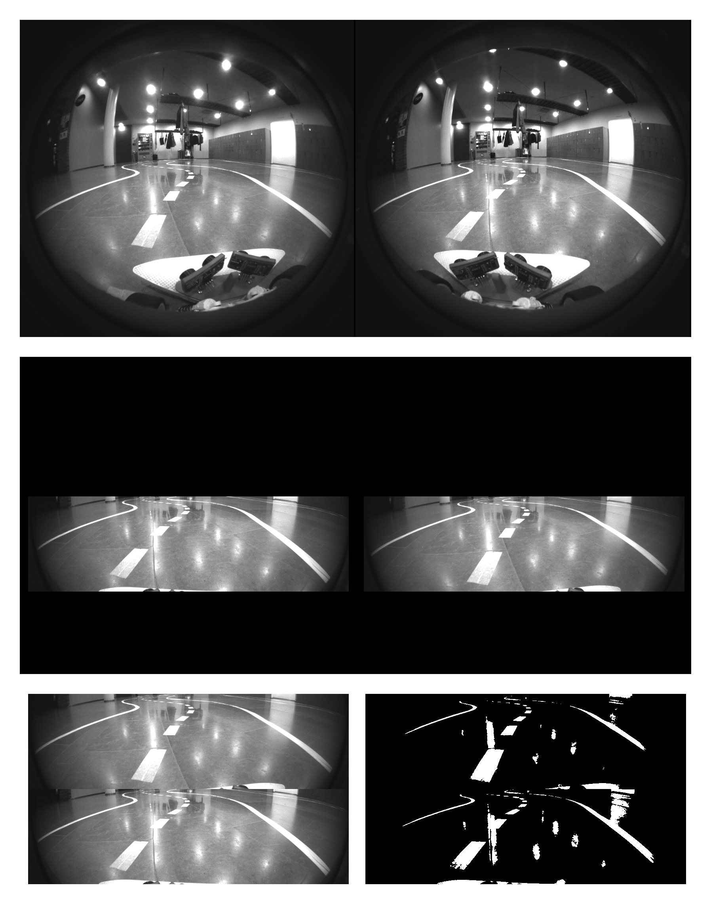

# t265-donkeycar-image-preprosessing

This is a simple image prosessing sample when using Realsense T265 camera with donkey car. This is a modification of nlhkh's donkeycar-jetson-nano project: https://github.com/nlhkh/donkeycar-jetson-nano

The code was used successfully in Aalto University's Protopaja ELEC-D0301 -course. Read more information about our project here: http://protopaja.aalto.fi/protopaja-2019/futurice-2/

Here is a demostration what the code does step-by-step:
